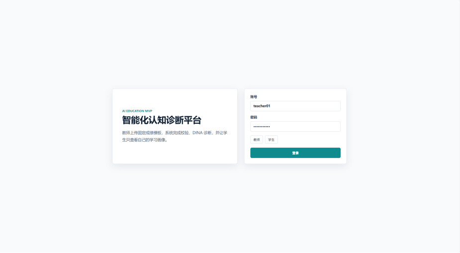
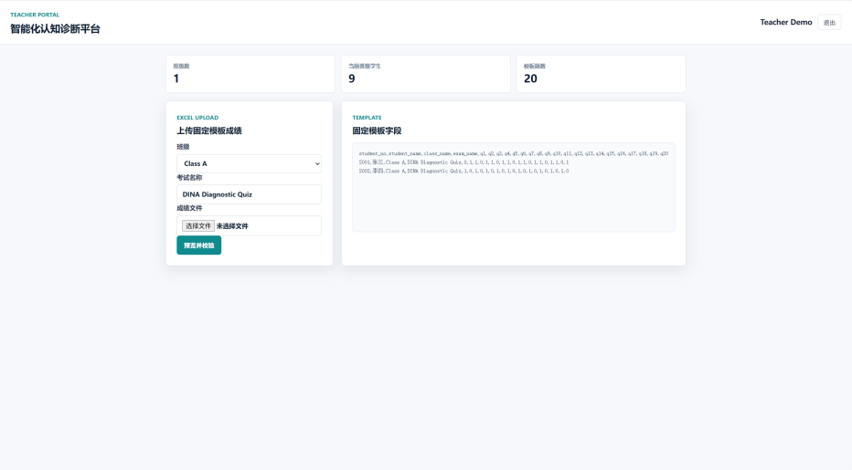
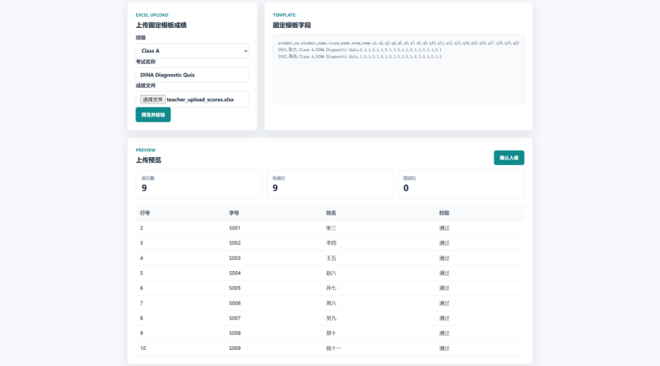
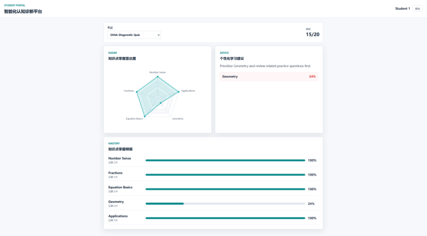

# 智能化认知诊断平台 MVP

这是一个面向简历展示和实习面试讲解的全栈教育诊断项目。项目目标不是做大而全的学校系统，而是完成一个清晰、可运行、可解释的产品闭环：

```text
教师登录
-> 上传固定模板 Excel 成绩
-> 系统预览并校验数据
-> 教师确认入库
-> 后端运行 DINA 诊断逻辑
-> 学生登录
-> 学生只查看自己的成绩、知识点掌握情况和学习建议
```

## MVP 范围

必须做：

- 教师/学生角色登录
- 基于角色的权限控制
- 学生只能访问自己的成绩和诊断结果
- 教师上传固定模板 `.xlsx` 成绩文件
- 上传预览、错误行提示、确认入库
- SQLite 存储用户、班级、题目、Q 矩阵、作答记录和诊断结果
- DINA-based 知识点掌握概率计算
- 学生端掌握率可视化和规则推荐建议

暂时不做：

- OCR 扫描件识别
- Word/PDF 试卷解析
- 真实 LLM 自动出题
- 多租户学校系统
- 复杂管理员后台
- 可变 Excel 模板

## 技术栈

| 层级 | 技术 |
| --- | --- |
| 前端 | React、TypeScript、Vite、ECharts、CSS Modules |
| 后端 | Node.js、Express、TypeScript |
| 数据库 | SQLite、better-sqlite3 |
| Excel | xlsx |
| 测试 | Vitest、supertest |

## 项目结构

```text
.
├── backend/                  后端 API、SQLite、算法与测试
│   ├── src/
│   │   ├── db.ts             数据库连接与 schema 初始化
│   │   ├── seed.ts           Demo 数据初始化
│   │   ├── diagnosis.ts      诊断/聚合逻辑
│   │   ├── server.ts         Express API 入口
│   │   └── algorithm/        DINA 算法模块
│   └── tests/                后端测试
├── frontend/                 React 前端
│   └── src/
│       ├── App.tsx           页面主入口
│       ├── components/       图表和页面组件
│       └── data/             API/mock 数据适配
├── docs/
│   ├── schema.md             SDD 数据库 Schema
│   ├── api.md                SDD REST API 契约
│   ├── excel-template.md     固定 Excel 上传模板
│   └── architecture.md       架构、权限边界和开发阶段
├── RUNNING.md                Windows 运行说明
├── start.bat                 Windows 双击启动脚本
├── start-dev.ps1             PowerShell 启动脚本
└── package.json              根目录统一命令
```

## 当前完成度

当前已经完成 **Step 1 到 Step 6 的简历 MVP 闭环**。

已经完成：

- SDD 文档：数据库 Schema、API 契约、Excel 模板、架构与权限边界
- TDD 合同测试：登录、权限、Excel 校验、预览不入库、确认入库、DINA 输出
- 后端 MVP：认证、RBAC、Excel 预览确认、DINA 诊断、学生个人结果 API
- 前端 MVP：教师端、学生端、上传预览、诊断可视化和学习建议
- E2E 测试：教师上传到学生查看诊断的完整链路
- 交付文档：Prompt 记录和开发过程说明

## 一键运行

在 Windows 下推荐执行：

```powershell
npm.cmd start
```

或者双击：

```text
start.bat
```

启动后访问：

```text
http://localhost:5173
```

后端默认地址：

```text
http://localhost:3000
```

## 测试账号

| 角色 | 账号 | 密码 |
| --- | --- | --- |
| 教师 | `teacher01` | `password123` |
| 学生 | `stu001` | `password123` |

首次启动或旧数据库缺少 MVP 用户时，后端会自动补齐 demo seed 数据。

## 手动运行

后端：

```powershell
cd C:\Users\User\Desktop\project\backend
npm.cmd install
npm.cmd start
```

前端：

```powershell
cd C:\Users\User\Desktop\project\frontend
npm.cmd install
npm.cmd run dev
```

## 常用命令

根目录：

```powershell
npm.cmd test
npm.cmd run build
npm.cmd run lint
npm.cmd run check
```

当前验证结果：

```text
backend tests: 49 passed
backend + frontend build: passed
frontend lint: passed
```

后端：

```powershell
cd C:\Users\User\Desktop\project\backend
npm.cmd test
npm.cmd run build
npm.cmd run seed
```

前端：

```powershell
cd C:\Users\User\Desktop\project\frontend
npm.cmd run dev
npm.cmd run build
npm.cmd run lint
```

## SDD 文档

- [docs/schema.md](docs/schema.md)
- [docs/api.md](docs/api.md)
- [docs/excel-template.md](docs/excel-template.md)
- [docs/architecture.md](docs/architecture.md)

## 交付文档

- [docs/prompts.md](docs/prompts.md)
- [docs/development-notes.md](docs/development-notes.md)

## 固定 Excel 模板

当前 MVP 只接受固定 `.xlsx` 模板，第一行为表头：

```text
student_no, student_name, class_name, exam_name,
q1, q2, q3, q4, q5, q6, q7, q8, q9, q10,
q11, q12, q13, q14, q15, q16, q17, q18, q19, q20
```

`q1` 到 `q20` 只允许 `0` 或 `1`。详细说明见 [docs/excel-template.md](docs/excel-template.md)。

## 核心 API

```text
POST /api/auth/login
GET  /api/teacher/classes
POST /api/teacher/uploads/preview
POST /api/teacher/uploads/:uploadId/confirm
GET  /api/student/me/results
GET  /api/student/me/diagnosis?examId=:examId
```

## Screenshots

将项目截图放到 `docs/screenshots/` 后，README 会直接展示完整演示闭环：









## 面试讲解定位

这个项目可以包装为：

> A full-stack AI-powered educational diagnosis platform with teacher/student portals, role-based access control, Excel score import with validation preview, DINA-based cognitive diagnosis, and student-facing mastery visualizations.

核心讲解重点是工程闭环和 AI 协作过程，而不是堆功能。
