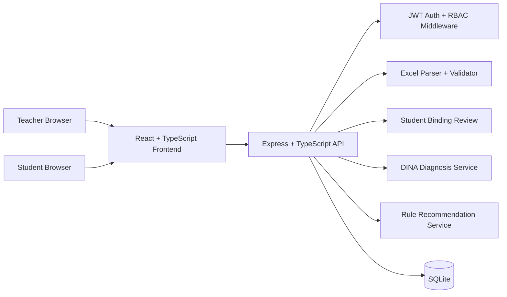
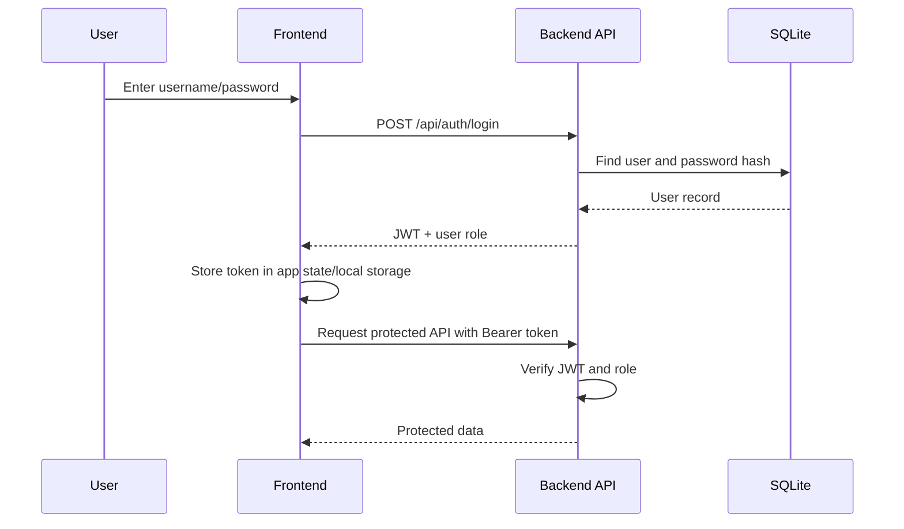
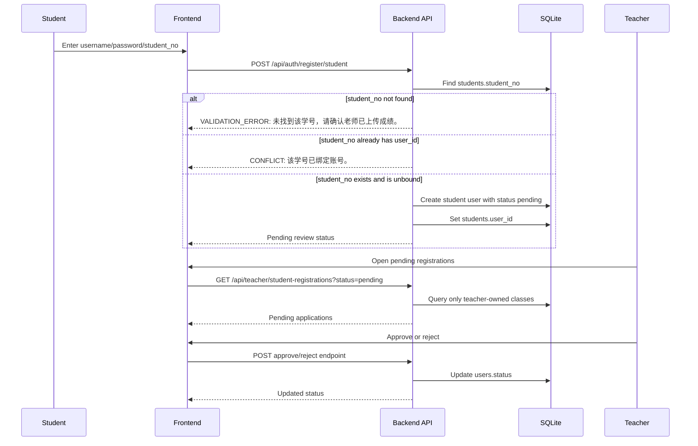
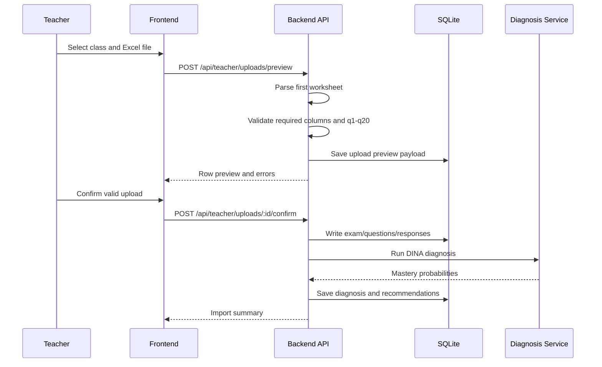
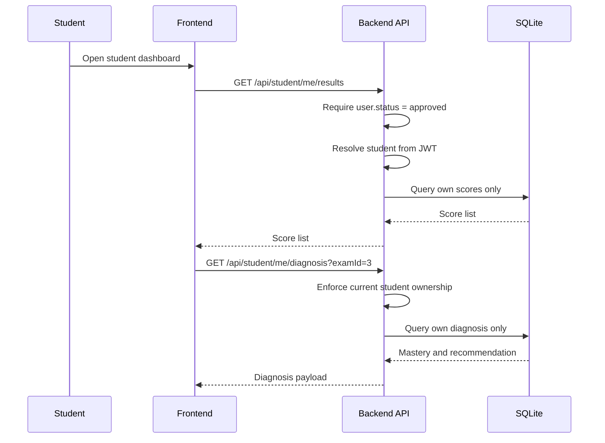

# SDD Step 1: Architecture and Permission Boundaries

## Product Boundary

This project is a full-stack educational diagnosis MVP for resume and interview use. The product story should stay narrow and complete:

```text
Teacher imports a fixed score sheet.
The system validates and stores answer data.
The backend runs a DINA-based diagnosis.
Students self-register with student_no, wait for teacher approval, then log in and can only view their own results.
```

## Non-Goals

The following features are explicitly postponed:

- OCR scan recognition,
- Word/PDF paper parsing,
- real LLM calls,
- automatic question generation,
- complex admin backend,
- school-level multi-tenancy,
- variable Excel schemas.

They may be documented as future work, but they should not enter the MVP implementation.

## Runtime Architecture



## Development Phases

| Step | Phase | Output |
| --- | --- | --- |
| 1 | SDD | Schema, API contract, Excel template, architecture docs, student registration and binding design. |
| 2 | Scaffold | `frontend` and `backend` project skeleton. |
| 3 | TDD | Backend tests for auth, upload validation, RBAC, and diagnosis. |
| 4 | Backend | SQLite, seed data, JWT, upload flow, DINA, student APIs. |
| 5 | DDD Frontend | Teacher and student dashboards driven by the API contract. |
| 6 | E2E + Docs | Playwright flow, README, prompt log, development notes, screenshots. |

## Role Permissions

### Teacher

Can:

- log in as `teacher`,
- view classes they own,
- upload Excel scores for their own classes,
- preview upload validation results,
- confirm valid uploads,
- view class-level diagnosis summaries for their own classes.
- view pending student registration and binding applications for classes they own,
- approve or reject pending student account bindings.

Cannot:

- upload to classes owned by another teacher,
- view another teacher's classes,
- bypass preview validation,
- confirm uploads with validation errors.
- approve or reject students outside their own classes.

### Student

Can:

- register with `username`, `password`, and `student_no`,
- check their own binding and review status,
- log in as `student`,
- view their own exam scores only after approval,
- view their own knowledge mastery profile only after approval,
- view their own weak points only after approval,
- view their own learning recommendation only after approval.

Cannot:

- view another student's scores,
- query by arbitrary `studentId`,
- access teacher upload APIs,
- view class-level dashboards.
- view any score or diagnosis data while `pending` or `rejected`.

## Auth Flow



## Student Registration and Teacher Review Flow



Review status behavior:

- `pending`: student can log in and call `/api/student/me/binding-status`, but cannot view results.
- `approved`: student can view only the results linked through their own `students.user_id`.
- `rejected`: student can log in and see the rejected status, but cannot view results.

## Teacher Upload Flow



## Student Result Flow



## Frontend Route Contract

| Route | Role | Purpose |
| --- | --- | --- |
| `/login` | public | Shared login page. |
| `/register/student` | public | Student self-registration with `student_no`. |
| `/teacher/classes` | teacher | Class list and latest diagnosis summary entry. |
| `/teacher/uploads` | teacher | Excel upload form. |
| `/teacher/uploads/:uploadId/preview` | teacher | Preview valid rows and errors. |
| `/teacher/classes/:classId/diagnosis` | teacher | Class diagnosis overview. |
| `/teacher/student-registrations` | teacher | Pending student account binding review. |
| `/student/status` | student | Pending/rejected/approved binding status page. |
| `/student/results` | student | Student score list. |
| `/student/diagnosis/:examId` | student | Mastery chart, weak points, recommendation. |

## Backend Module Contract

Suggested module boundaries:

| Module | Responsibility |
| --- | --- |
| `auth` | Login, password hashing, JWT issue/verify. |
| `rbac` | Role and ownership middleware. |
| `db` | SQLite connection, migrations/schema creation. |
| `seed` | Demo teacher, students, class, questions, Q matrix. |
| `excel` | `.xlsx` parsing and row validation. |
| `uploads` | Preview and confirm workflow. |
| `studentRegistration` | Student self-registration, student_no binding, pending status query. |
| `studentReview` | Teacher-owned pending application list, approve, and reject actions. |
| `diagnosis` | DINA input building and mastery calculation. |
| `recommendations` | Rule-based advice from weak knowledge points. |
| `routes` | Express route registration. |

## Recommendation Rule for MVP

Use a deterministic rule first:

```text
mastery < 0.60:
  weak point, recommend reviewing this knowledge point first
0.60 <= mastery < 0.80:
  medium point, recommend targeted practice
mastery >= 0.80:
  strong point, recommend consolidation
```

This is enough for the basic requirement. Real LLM generation can be listed as future work.

## Quality Gates

Each implementation phase should report:

- completed work,
- changed files,
- commands run,
- test result,
- remaining risks.

Before moving beyond SDD, the project should have these four documents:

- `docs/schema.md`
- `docs/api.md`
- `docs/excel-template.md`
- `docs/architecture.md`
