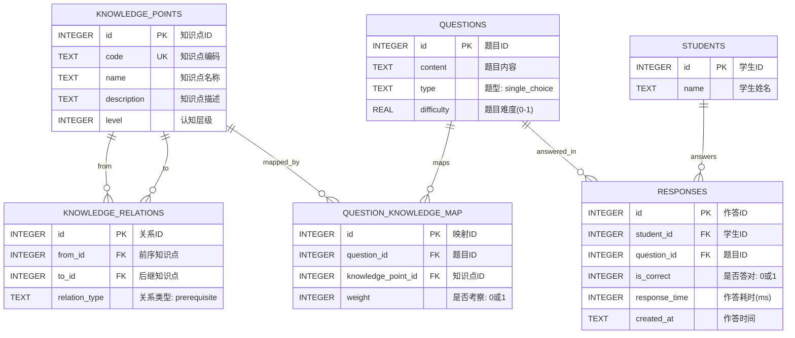

# SDD 阶段：数据库 Schema 与接口契约设计

## 1. 设计思路（Schema-Driven）

本阶段遵循 **Spec/Schema-Driven Development**，先定义数据结构与接口契约，作为后续前端（DDD）与算法（TDD）的"锚点"。

### 核心原则
- **单一职责**：每张表只负责一个领域概念（学生、知识点、题目、作答、图谱关系）
- **可追踪性**：所有算法输入（Q矩阵、X矩阵）均可从表中直接导出
- **可扩展性**：Schema 预留了 `weight`、`response_time` 等字段，便于后续算法优化

---

## 2. ER 图



---

## 3. 表结构说明

### 3.1 knowledge_points（知识点表）
存储5个核心知识点，用于构建知识图谱节点。

| 字段 | 类型 | 约束 | 说明 |
|------|------|------|------|
| id | INTEGER | PK | 自增主键 |
| code | TEXT | UK, NOT NULL | 编码，如 `addition_basic` |
| name | TEXT | NOT NULL | 名称，如 "加法基础" |
| description | TEXT | | 描述 |
| level | INTEGER | NOT NULL DEFAULT 1 | 认知层级（1=基础，2=进阶，3=综合） |

### 3.2 knowledge_relations（知识图谱关系表）
存储知识点之间的前序/后继关系，支持知识图谱可视化。

| 字段 | 类型 | 约束 | 说明 |
|------|------|------|------|
| id | INTEGER | PK | 自增主键 |
| from_id | INTEGER | FK, NOT NULL | 前序知识点ID |
| to_id | INTEGER | FK, NOT NULL | 后继知识点ID |
| relation_type | TEXT | NOT NULL DEFAULT 'prerequisite' | 关系类型 |

### 3.3 questions（题目表）
存储20道测试题。

| 字段 | 类型 | 约束 | 说明 |
|------|------|------|------|
| id | INTEGER | PK | 自增主键 |
| content | TEXT | NOT NULL | 题目内容 |
| type | TEXT | NOT NULL DEFAULT 'single_choice' | 题型 |
| difficulty | REAL | NOT NULL DEFAULT 0.5 | 难度系数 0-1 |

### 3.4 question_knowledge_map（Q矩阵表）
**核心表**。存储题目与知识点的关联（Q矩阵），`weight=1` 表示该题考察该知识点。

| 字段 | 类型 | 约束 | 说明 |
|------|------|------|------|
| id | INTEGER | PK | 自增主键 |
| question_id | INTEGER | FK, NOT NULL | 题目ID |
| knowledge_point_id | INTEGER | FK, NOT NULL | 知识点ID |
| weight | INTEGER | NOT NULL DEFAULT 1 | 关联权重（0或1） |

**唯一约束**：`(question_id, knowledge_point_id)`

### 3.5 students（学生表）
存储至少10名学生的基本信息。

| 字段 | 类型 | 约束 | 说明 |
|------|------|------|------|
| id | INTEGER | PK | 自增主键 |
| name | TEXT | NOT NULL | 学生姓名 |

### 3.6 responses（作答记录表）
**核心表**。存储X矩阵数据，即学生的作答情况。

| 字段 | 类型 | 约束 | 说明 |
|------|------|------|------|
| id | INTEGER | PK | 自增主键 |
| student_id | INTEGER | FK, NOT NULL | 学生ID |
| question_id | INTEGER | FK, NOT NULL | 题目ID |
| is_correct | INTEGER | NOT NULL | 是否答对（0=错，1=对） |
| response_time | INTEGER | | 作答耗时（毫秒） |
| created_at | TEXT | NOT NULL DEFAULT CURRENT_TIMESTAMP | 作答时间 |

**唯一约束**：`(student_id, question_id)` —— 假设每名学生每道题只作答一次

---

## 4. Q矩阵与X矩阵的导出方式

### Q矩阵（题目 × 知识点）
```sql
SELECT q.id AS question_id,
       kp.id AS knowledge_point_id,
       COALESCE(qkm.weight, 0) AS weight
FROM questions q
CROSS JOIN knowledge_points kp
LEFT JOIN question_knowledge_map qkm
  ON qkm.question_id = q.id AND qkm.knowledge_point_id = kp.id
ORDER BY q.id, kp.id;
```

### X矩阵（学生 × 题目）
```sql
SELECT s.id AS student_id,
       q.id AS question_id,
       COALESCE(r.is_correct, 0) AS is_correct
FROM students s
CROSS JOIN questions q
LEFT JOIN responses r
  ON r.student_id = s.id AND r.question_id = q.id
ORDER BY s.id, q.id;
```

---

## 5. 接口契约（API Spec）

详见 `src/types.ts`。核心接口包括：

- `KnowledgePoint` / `KnowledgeRelation`：知识图谱数据结构
- `Question` / `QuestionKnowledgeMap`：题目与Q矩阵数据结构
- `Student` / `Response`：学生与X矩阵数据结构
- `DiagnosisResult`：算法层输出（学生各知识点的掌握概率）
- `DiagnosisRequest` / `DiagnosisResponse`：API 请求/响应契约

---

## 6. 与后续阶段的衔接

| 阶段 | 如何使用本阶段产物 |
|------|-------------------|
| **DDD（前端）** | 基于 `knowledge_points` + `knowledge_relations` 绘制知识图谱；基于 `DiagnosisResult` 绘制雷达图 |
| **TDD（算法）** | 从 `question_knowledge_map` 读取Q矩阵，从 `responses` 读取X矩阵，输入DINA模型计算掌握概率 |
| **E2E（整合）** | 通过 `DiagnosisRequest` / `DiagnosisResponse` 契约打通前后端 |
