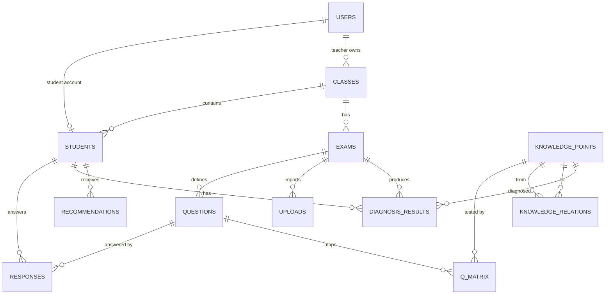

# SDD Step 1: SQLite Schema Design

## MVP Scope

This schema supports the resume-oriented MVP only:

```text
Teacher login
-> upload fixed Excel score file
-> preview and validate rows
-> confirm import
-> run DINA diagnosis
-> student login
-> student views own score, mastery profile, weak points, recommendations
```

Out of scope for this phase: OCR, Word/PDF parsing, auto question generation, multi-tenant school management, complex admin console, and real LLM calls.

## Core Entities

| Entity | Purpose |
| --- | --- |
| `users` | Login accounts for teachers and students. |
| `classes` | Basic class grouping owned by a teacher. |
| `students` | Student profile linked to a login account and class. |
| `knowledge_points` | Five knowledge points used by the Q matrix and diagnosis. |
| `knowledge_relations` | Simple prerequisite graph between knowledge points. |
| `exams` | One score import batch, such as "Diagnostic Quiz 1". |
| `questions` | Twenty fixed questions for the MVP exam template. |
| `q_matrix` | Question-to-knowledge mapping. This is the Q matrix. |
| `uploads` | Teacher upload batch metadata and status. |
| `responses` | Student answer records. This is the X matrix source. |
| `diagnosis_results` | DINA output per student and knowledge point. |
| `recommendations` | Rule-based learning suggestions generated from diagnosis results. |

## ER Diagram



## Table Definitions

### `users`

Stores authentication identities.

| Column | Type | Constraint | Notes |
| --- | --- | --- | --- |
| `id` | INTEGER | PK | Auto increment. |
| `username` | TEXT | UNIQUE, NOT NULL | Login name, such as `teacher01` or `stu001`. |
| `password_hash` | TEXT | NOT NULL | Hashed password. Never store plain text. |
| `role` | TEXT | NOT NULL | `teacher` or `student`. |
| `display_name` | TEXT | NOT NULL | Name shown in UI. |
| `created_at` | TEXT | NOT NULL | ISO datetime. |

### `classes`

| Column | Type | Constraint | Notes |
| --- | --- | --- | --- |
| `id` | INTEGER | PK | Auto increment. |
| `name` | TEXT | NOT NULL | Example: `Class A`. |
| `teacher_user_id` | INTEGER | FK -> users.id, NOT NULL | Owner teacher. |
| `created_at` | TEXT | NOT NULL | ISO datetime. |

### `students`

| Column | Type | Constraint | Notes |
| --- | --- | --- | --- |
| `id` | INTEGER | PK | Internal student id. |
| `user_id` | INTEGER | FK -> users.id, UNIQUE, NOT NULL | Student login account. |
| `class_id` | INTEGER | FK -> classes.id, NOT NULL | Student class. |
| `student_no` | TEXT | UNIQUE, NOT NULL | External id in Excel, such as `S001`. |
| `name` | TEXT | NOT NULL | Student name. |

### `knowledge_points`

The MVP uses exactly five seeded knowledge points.

| Column | Type | Constraint | Notes |
| --- | --- | --- | --- |
| `id` | INTEGER | PK | Auto increment. |
| `code` | TEXT | UNIQUE, NOT NULL | Stable code, such as `kp_fraction`. |
| `name` | TEXT | NOT NULL | Display name. |
| `description` | TEXT |  | Short explanation. |
| `sort_order` | INTEGER | NOT NULL | UI and radar chart order. |

### `knowledge_relations`

Simple knowledge graph for prerequisite/successor display.

| Column | Type | Constraint | Notes |
| --- | --- | --- | --- |
| `id` | INTEGER | PK | Auto increment. |
| `from_knowledge_point_id` | INTEGER | FK -> knowledge_points.id, NOT NULL | Prerequisite node. |
| `to_knowledge_point_id` | INTEGER | FK -> knowledge_points.id, NOT NULL | Successor node. |
| `relation_type` | TEXT | NOT NULL | Default `prerequisite`. |

Unique constraint: `(from_knowledge_point_id, to_knowledge_point_id, relation_type)`.

### `exams`

| Column | Type | Constraint | Notes |
| --- | --- | --- | --- |
| `id` | INTEGER | PK | Auto increment. |
| `class_id` | INTEGER | FK -> classes.id, NOT NULL | Exam class. |
| `name` | TEXT | NOT NULL | Example: `DINA Diagnostic Quiz`. |
| `question_count` | INTEGER | NOT NULL | Must be `20` for the fixed template MVP. |
| `created_by_user_id` | INTEGER | FK -> users.id, NOT NULL | Teacher who created/imported it. |
| `created_at` | TEXT | NOT NULL | ISO datetime. |

### `questions`

| Column | Type | Constraint | Notes |
| --- | --- | --- | --- |
| `id` | INTEGER | PK | Auto increment. |
| `exam_id` | INTEGER | FK -> exams.id, NOT NULL | Exam owner. |
| `question_no` | INTEGER | NOT NULL | 1 to 20. |
| `content` | TEXT |  | Optional placeholder text. |
| `difficulty` | REAL | NOT NULL | 0 to 1, seeded default 0.5. |

Unique constraint: `(exam_id, question_no)`.

### `q_matrix`

Defines which knowledge points each question tests.

| Column | Type | Constraint | Notes |
| --- | --- | --- | --- |
| `id` | INTEGER | PK | Auto increment. |
| `question_id` | INTEGER | FK -> questions.id, NOT NULL | Question. |
| `knowledge_point_id` | INTEGER | FK -> knowledge_points.id, NOT NULL | Knowledge point. |
| `weight` | INTEGER | NOT NULL | `1` means tested. MVP can treat any row as weight 1. |

Unique constraint: `(question_id, knowledge_point_id)`.

### `uploads`

Tracks teacher Excel import batches.

| Column | Type | Constraint | Notes |
| --- | --- | --- | --- |
| `id` | INTEGER | PK | Auto increment. |
| `teacher_user_id` | INTEGER | FK -> users.id, NOT NULL | Uploader. |
| `class_id` | INTEGER | FK -> classes.id, NOT NULL | Target class. |
| `exam_id` | INTEGER | FK -> exams.id | Set after confirm if created during import. |
| `original_filename` | TEXT | NOT NULL | Uploaded file name. |
| `status` | TEXT | NOT NULL | `previewed`, `confirmed`, or `rejected`. |
| `row_count` | INTEGER | NOT NULL | Parsed data rows. |
| `error_count` | INTEGER | NOT NULL | Validation error count. |
| `preview_payload_json` | TEXT | NOT NULL | Parsed preview rows and errors before confirm. |
| `created_at` | TEXT | NOT NULL | ISO datetime. |
| `confirmed_at` | TEXT |  | ISO datetime after confirmation. |

### `responses`

Stores imported X matrix values.

| Column | Type | Constraint | Notes |
| --- | --- | --- | --- |
| `id` | INTEGER | PK | Auto increment. |
| `exam_id` | INTEGER | FK -> exams.id, NOT NULL | Exam. |
| `student_id` | INTEGER | FK -> students.id, NOT NULL | Student. |
| `question_id` | INTEGER | FK -> questions.id, NOT NULL | Question. |
| `is_correct` | INTEGER | NOT NULL | `0` or `1`. |
| `upload_id` | INTEGER | FK -> uploads.id, NOT NULL | Import batch. |
| `created_at` | TEXT | NOT NULL | ISO datetime. |

Unique constraint: `(exam_id, student_id, question_id)`.

### `diagnosis_results`

Stores one DINA diagnosis row per student, exam, and knowledge point.

| Column | Type | Constraint | Notes |
| --- | --- | --- | --- |
| `id` | INTEGER | PK | Auto increment. |
| `exam_id` | INTEGER | FK -> exams.id, NOT NULL | Exam. |
| `student_id` | INTEGER | FK -> students.id, NOT NULL | Student. |
| `knowledge_point_id` | INTEGER | FK -> knowledge_points.id, NOT NULL | Knowledge point. |
| `mastery_probability` | REAL | NOT NULL | 0 to 1. |
| `evidence_correct` | INTEGER | NOT NULL | Correct answers on related questions. |
| `evidence_total` | INTEGER | NOT NULL | Related question count. |
| `model_version` | TEXT | NOT NULL | Example: `dina-basic-v1`. |
| `created_at` | TEXT | NOT NULL | ISO datetime. |

Unique constraint: `(exam_id, student_id, knowledge_point_id, model_version)`.

### `recommendations`

| Column | Type | Constraint | Notes |
| --- | --- | --- | --- |
| `id` | INTEGER | PK | Auto increment. |
| `exam_id` | INTEGER | FK -> exams.id, NOT NULL | Exam. |
| `student_id` | INTEGER | FK -> students.id, NOT NULL | Student. |
| `content` | TEXT | NOT NULL | Rule-based personalized suggestion. |
| `source` | TEXT | NOT NULL | `rule`. Future value may be `llm`. |
| `created_at` | TEXT | NOT NULL | ISO datetime. |

## Q Matrix Export

```sql
SELECT
  q.question_no,
  kp.code AS knowledge_code,
  CASE WHEN qm.id IS NULL THEN 0 ELSE qm.weight END AS weight
FROM questions q
CROSS JOIN knowledge_points kp
LEFT JOIN q_matrix qm
  ON qm.question_id = q.id
 AND qm.knowledge_point_id = kp.id
WHERE q.exam_id = ?
ORDER BY q.question_no, kp.sort_order;
```

## X Matrix Export

```sql
SELECT
  s.student_no,
  q.question_no,
  r.is_correct
FROM responses r
JOIN students s ON s.id = r.student_id
JOIN questions q ON q.id = r.question_id
WHERE r.exam_id = ?
ORDER BY s.student_no, q.question_no;
```

## Seed Data Contract

The implementation should seed:

- 1 teacher account: `teacher01`
- 10 student accounts: `stu001` to `stu010`
- 1 class: `Class A`
- 5 knowledge points
- 1 default exam with 20 questions
- A fixed 20 x 5 Q matrix

Passwords may use demo defaults in development, but must still be hashed in the database.
