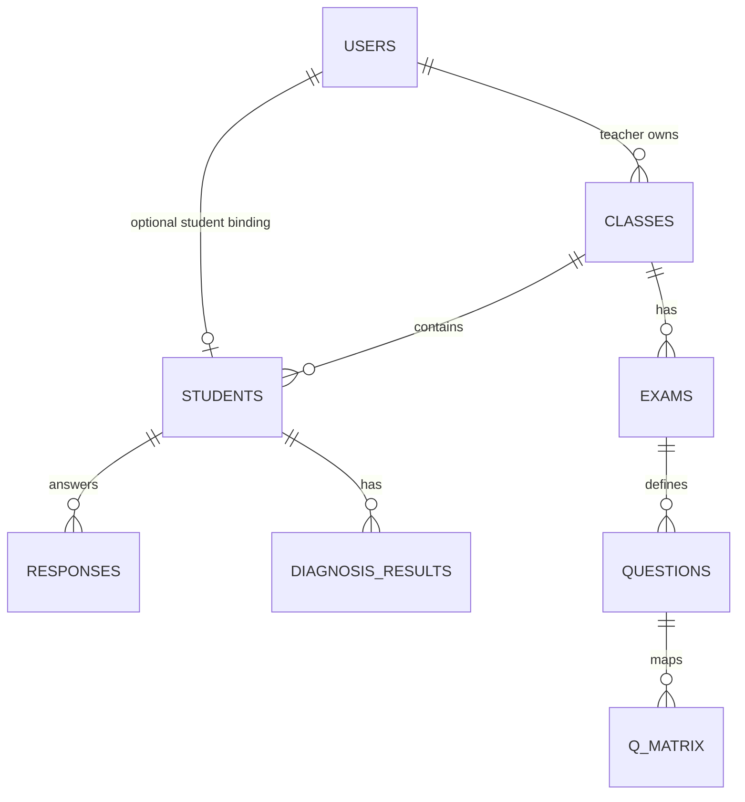

# SQLite Schema Design

## Product Loop

```text
Teacher login
-> upload fixed Excel score file
-> preview and validate rows
-> confirm import
-> run DINA diagnosis
-> student self-registers with student_no
-> teacher approves or rejects the binding
-> approved student views own score, mastery profile, weak points, recommendations
```

Out of scope: OCR, Word/PDF parsing, email/SMS verification, real LLM calls, complex admin backend, and multi-tenant school management.

## Core Entities

| Table | Purpose |
| --- | --- |
| `users` | Login accounts for teachers and students. |
| `classes` | Basic class grouping owned by a teacher. |
| `students` | Student profile imported/seeded by teachers and optionally bound to a login account. |
| `uploads` | Teacher Excel upload preview and confirm metadata. |
| `exams`, `questions`, `q_matrix` | Fixed 20-question MVP exam and Q matrix. |
| `responses` | Student answer records used as the X matrix. |
| `diagnosis_results` | DINA mastery output per student and knowledge point. |
| `recommendations` | Rule-based learning suggestions. |
| `grades`, `subjects`, `papers`, `student_scores`, `question_scores` | Multi-subject score-analysis tables kept for the current project version. |

## Important Relationship



## `users`

| Column | Type | Constraint | Notes |
| --- | --- | --- | --- |
| `id` | INTEGER | PK | Auto increment. |
| `username` | TEXT | UNIQUE, NOT NULL | Login name. |
| `password_hash` | TEXT | NOT NULL | Demo project stores simple values; production should use a real hash. |
| `role` | TEXT | NOT NULL | `teacher` or `student`. |
| `status` | TEXT | NOT NULL, default `approved` | `pending`, `approved`, or `rejected`. |
| `display_name` | TEXT | NOT NULL | Name shown in UI. |
| `created_at` | TEXT | NOT NULL | ISO datetime / SQLite timestamp. |

Rules:

- Teacher accounts are always `approved`.
- New student self-registration creates `role = 'student'` and `status = 'pending'`.
- `pending` and `rejected` students may log in only to view review status.
- Only `approved` students can access scores, diagnosis, and recommendations.

## `students`

| Column | Type | Constraint | Notes |
| --- | --- | --- | --- |
| `id` | INTEGER | PK | Internal student id. |
| `user_id` | INTEGER | FK -> `users.id`, nullable | Bound login account. Null means the score record exists but no account is bound yet. |
| `student_no` | TEXT | UNIQUE | External student number used for registration binding. |
| `class_id` | INTEGER | FK -> `classes.id` | Class used by teacher ownership checks. |
| `name` | TEXT | NOT NULL | Student name from seed/imported data. |
| `external_id` | TEXT | UNIQUE | Existing multi-subject external id. |
| `grade_id` | INTEGER | FK -> `grades.id` | Existing multi-subject grade id. |
| `class_name` | TEXT | NOT NULL | Display class name. |
| `status` | TEXT | NOT NULL | Student record status such as `active`. |

## `student_no` Binding Rules

1. Student registration accepts only `username`, `password`, and `student_no`.
2. The backend matches `student_no` against `students.student_no`.
3. If `student_no` does not exist, return `VALIDATION_ERROR`: `未找到该学号，请确认老师已上传成绩。`
4. If `students.user_id` is already set, return `CONFLICT`: `该学号已绑定账号。`
5. If the row exists and `user_id` is null, create a pending student user and set `students.user_id`.
6. Teacher approval updates `users.status` to `approved`.
7. Teacher rejection updates `users.status` to `rejected`.
8. Rejected bindings are retained for audit and to prevent repeated binding attempts with the same `student_no`.

Recommended indexes:

```sql
CREATE INDEX IF NOT EXISTS idx_users_role_status ON users(role, status);
CREATE INDEX IF NOT EXISTS idx_students_user_id ON students(user_id);
CREATE INDEX IF NOT EXISTS idx_students_student_no ON students(student_no);
```

## Teacher Review Ownership

Teacher review endpoints join:

```text
users -> students -> classes
```

The teacher can approve or reject an application only when `classes.teacher_user_id` equals the current teacher user id.

## MVP Upload Tables

### `uploads`

Tracks Excel upload preview and confirm state.

| Column | Type | Notes |
| --- | --- | --- |
| `teacher_user_id` | INTEGER | Uploader. |
| `class_id` | INTEGER | Target class. |
| `exam_id` | INTEGER | Set after confirmation. |
| `status` | TEXT | `previewed`, `confirmed`, or `rejected`. |
| `preview_payload_json` | TEXT | Parsed rows and validation errors. |

### `responses`

Stores fixed-template Q1-Q20 answer records.

| Column | Type | Notes |
| --- | --- | --- |
| `exam_id` | INTEGER | Exam id. |
| `student_id` | INTEGER | Student id. |
| `question_id` | INTEGER | Question id. |
| `is_correct` | INTEGER | `0` or `1`. |
| `upload_id` | INTEGER | Source upload. |

Unique constraint: `(exam_id, student_id, question_id)`.

### `diagnosis_results`

Stores DINA mastery output.

| Column | Type | Notes |
| --- | --- | --- |
| `exam_id` | INTEGER | Exam id. |
| `student_id` | INTEGER | Student id. |
| `knowledge_point_id` | INTEGER | Knowledge point id. |
| `mastery_probability` | REAL | 0 to 1. |
| `evidence_correct` | INTEGER | Correct related answers. |
| `evidence_total` | INTEGER | Related question count. |
| `model_version` | TEXT | Example: `dina-basic-v1`. |

## Seed Contract

The demo seed creates:

- 1 teacher account: `teacher01`
- Demo students with `student_no` such as `S001`, `S002`, `S003`
- 1 class: `Class A`
- Fixed 20-question MVP exam and Q matrix
- Multi-subject exam/score data used by the current dashboard

Some demo student accounts may already be approved for quick login. Self-registration tests explicitly clear selected `students.user_id` values in the in-memory database.
