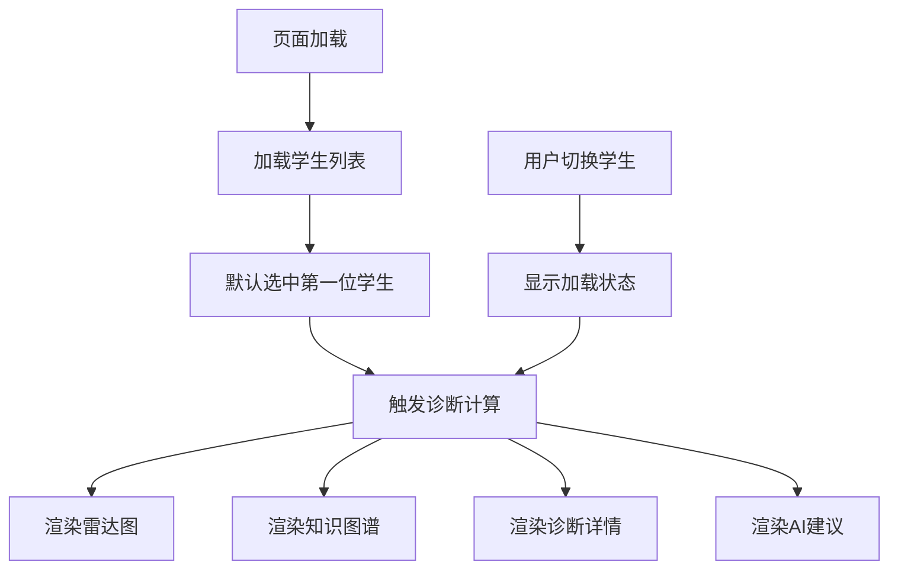
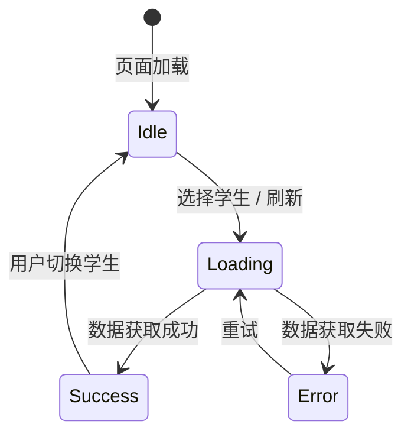

# DDD 阶段：前端 UI/UX 设计文档

## 1. 设计哲学（Design-Driven）

本阶段遵循 **Design-Driven Development**，以用户体验为核心驱动前端组件拆分与状态流转。所有技术决策服务于"让教师/学生一眼看清认知盲区"这一核心目标。

### 设计原则
- **信息层级清晰**：诊断结果 > 知识图谱 > 学习建议，视线自上而下自然流动
- **即时反馈**：选择学生后所有可视化组件应在 500ms 内完成更新
- **色彩语义化**：掌握度用蓝-绿渐变（安全/成长），盲区用橙-红警示
- **移动端优先**：单栏布局，最小适配 375px 宽度

---

## 2. 页面布局

### 2.1 整体结构（单页应用）

```
+--------------------------------------------------+
|  🎓 智能化认知诊断 MVP                            |  Header
+--------------------------------------------------+
|  请选择学生：[ 张三 ▼ ]                          |  Control Panel
+--------------------------------------------------+
|  +-------------------+  +---------------------+  |
|  |  📊 认知雷达图     |  |  🧠 知识掌握地图     |  |  Main Content
|  |                   |  |                     |  |
|  |  (五维雷达图)      |  |  (力导向知识图谱)    |  |
|  +-------------------+  +---------------------+  |
|  +---------------------------------------------+  |
|  |  📋 诊断详情                                   |  |
|  |  - 加法基础：92% ✅                           |  |  Detail Panel
|  |  - 减法基础：78% ⚠️                           |  |
|  +---------------------------------------------+  |
|  +---------------------------------------------+  |
|  |  💡 AI 学习建议                                |  |  Suggestion Panel
|  |  "你在加减混合运算中表现较弱，建议先巩固..."    |  |
|  +---------------------------------------------+  |
+--------------------------------------------------+
```

### 2.2 响应式断点

| 断点 | 布局 | 说明 |
|------|------|------|
| ≥1024px | 双栏：雷达图 + 知识图谱并排 | 桌面端 |
| 768px~1023px | 双栏比例 1:1 | 平板端 |
| <768px | 单栏：自上而下堆叠 | 手机端 |

---

## 3. 交互流程



### 状态流转图



---

## 4. 组件树设计

```
App (全局状态: selectedStudentId, diagnosisResult, loading, error)
├── Header (静态标题)
├── StudentSelector (props: students, value, onChange)
├── DiagnosisDashboard (props: diagnosisResult, loading)
│   ├── RadarChart (props: knowledges)
│   ├── KnowledgeGraph (props: knowledges, relations)
│   └── MasteryDetail (props: knowledges)
└── SuggestionPanel (props: suggestion)
```

### 组件职责

| 组件 | 职责 | 输入 Props | 输出 Event |
|------|------|-----------|-----------|
| `StudentSelector` | 下拉选择学生 | `students`, `selectedId` | `onSelect(id)` |
| `RadarChart` | 五维雷达图展示掌握概率 | `knowledges: KnowledgeMastery[]` | 无 |
| `KnowledgeGraph` | 力导向知识图谱，节点大小编码掌握度 | `knowledges`, `relations` | `onNodeClick(id)` |
| `MasteryDetail` | 列表展示各知识点掌握度与评级 | `knowledges` | 无 |
| `SuggestionPanel` | 展示LLM生成的个性化建议 | `suggestion: string` | 无 |
| `App` | 全局状态管理，协调数据流 | - | - |

---

## 5. 视觉规范

### 5.1 色彩系统

| 用途 | 色值 | 说明 |
|------|------|------|
| 主色 | `#2563EB` | 蓝色，用于主按钮、高亮 |
| 成功/高掌握 | `#10B981` | 绿色，掌握度 ≥80% |
| 警告/中掌握 | `#F59E0B` | 橙色，掌握度 50%~80% |
| 危险/低掌握 | `#EF4444` | 红色，掌握度 <50% |
| 背景 | `#F8FAFC` | 浅灰蓝 |
| 卡片背景 | `#FFFFFF` | 白色，带阴影 |
| 文字主色 | `#1E293B` | 深蓝灰 |
| 文字次要 | `#64748B` | 中灰 |

### 5.2 字体

- 中文：`system-ui, -apple-system, "PingFang SC", "Microsoft YaHei", sans-serif`
- 数字：`"SF Mono", monospace`

### 5.3 间距系统

基于 4px 网格：`4, 8, 12, 16, 24, 32, 48`

---

## 6. Mock 数据策略

本阶段不调用真实 API，使用 mock 数据驱动 UI 渲染。Mock 数据需覆盖 3 种典型学生画像：

1. **学霸型**（张三）：全知识点掌握度 >85%，雷达图饱满
2. **偏科型**（李四）：加减运算强，乘除运算弱，雷达图不对称
3. **薄弱型**（王五）：多数知识点 <50%，雷达图收缩，建议面板内容较长

Mock 数据格式严格遵循 `src/types.ts` 中的 `DiagnosisResult` 接口。

---

## 7. 技术栈

| 层 | 技术 | 选型理由 |
|----|------|---------|
| 构建工具 | Vite 6 | 极速冷启动，原生 ESM，配置极简 |
| 框架 | React 19 + TypeScript | 组件化开发，类型安全，配合 `types.ts` 契约 |
| 图表 | ECharts 5 | 雷达图 + 关系图（力导向）一体解决，中文文档完善 |
| 样式 | CSS Modules | 避免命名冲突，无需引入 CSS-in-JS 运行时开销 |
| 包管理 | npm | 标准方案，无需额外学习成本 |

---

## 8. 与前后阶段的衔接

| 阶段 | 衔接点 |
|------|--------|
| **SDD（上游）** | 消费 `src/types.ts` 中的类型定义；UI布局围绕 `DiagnosisResult` 结构展开 |
| **TDD（下游）** | 本阶段组件预留 `DiagnosisResult` props 注入点，TDD阶段只需替换 mock 数据源为真实算法输出 |
| **E2E（整合）** | `App` 组件中的状态管理逻辑（`fetchDiagnosis`）将在 E2E 阶段接入真实 HTTP API |
